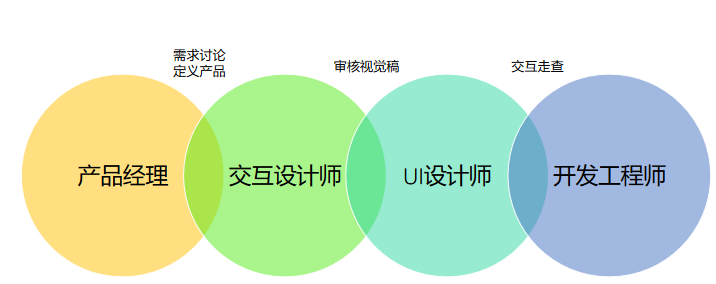
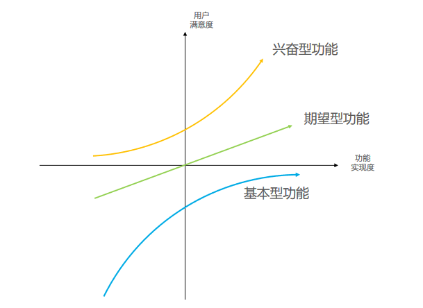

## 互联网产品开发流程

**前期分析**（商业、用户、市场）

**产品定义**

**交互设计**

**UI设计**

**产品开发**

**测试优化**

**产品发布**

以上过程需要循环迭代

### 交互设计师的价值

**职能价值**

1. 将需求转化为解决方案
2. 将解决方案可视化供团队讨论
3. 帮助确认和发掘产品的更多可能性

**数据价值**

1. 将设计的解决方案转换为数据价值
2. 帮助促进业务增长和产品发展

与视觉设计师不同的是，交互设计**倾向于用户目标的实现**，视觉设计倾向于美化和外显表达。

人、技术、行为、场景

### 交互设计评估

**有用性**

- 业务目标
- 用户体验

**可用性**

- 场景贴切
- 灵活
- 及时反馈
- 向导作用
- 可控
- 减法
- 防错机制
- 商业

**吸引力**

基本型功能都做不好？

只把基本型功能做好了？

做了兴奋型功能漏了基本型功能？

期望型功能搞砸了？

