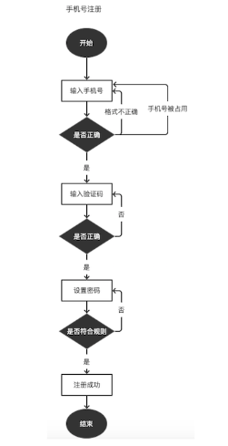
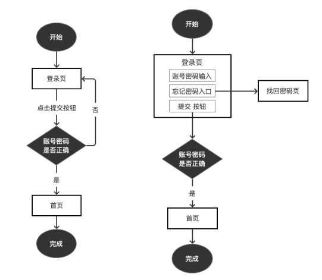

## 功能信息架构

对功能信息的组织和归类，让用户更容易理解和使用一个产品。

《破茧成蝶1》：用户体验师的成长之路

《破茧成蝶2》：以产品为中心的设计革命

**如何设计信息架构**

1. 满足用户目标
2. 满足产品目标

**工具类产品的痛点**

很难具体得到清晰的用户画像，用户基本上是用完即走，火车票机票购买、地铁公交扫码，通常以小程序、H5使用频率最高。

**互联网产品的功能信息架构**

1. 内容架构
2. 功能架构

## 流程设计

**体现业务目标和用户目标**

用户想完成的任务？

产品想完成的任务？

15年微信和春晚合作，发起抢红包活动，侧面目的：抗衡支付宝。两天左右绑定了2亿张银行卡。而支付宝绑定2亿张用了8年时间。

支付宝就是做不好社交？

1. 用户场景？
2. 基因？
3. 二者兼有？

流程设计的最终目的：**让用户顺利地完成任务。**

以不干扰用户使用流程的方式完成业务需求

### 流程图自查

不应考验阅读者的理解能力，最好是一眼便能看懂主体流程是怎样的，但不要过分简单。

考虑周群

### 业务流程图

描述产品业务逻辑的流转路径，通常包含前端、后台系统、以及不同的用户角色，以**泳道图**来呈现，产品经理使用的比较多。

### 任务流程图

完成某个具体任务的操作流程，帮助交互设计师理清需求的关键任务路径，便于产品上下游人员快速了解核心操作流。

### 页面流程图

描述产品页面之间的流向关系

