好的设计解决问题

## 原型设计

用具体的页面来解决抽象的需求

**设计要点**

- 功能的呈现方式
- 信息的呈现方式
- 用户对界面交互的方式
- 界面对用户操作的响应

### 功能的呈现

核心功能、常用功能、推荐功能、其他功能

**常用导航方式**

标签（Tab）式导航（上、下），宫格式导航、列表式导航、抽屉（侧滑）式导航

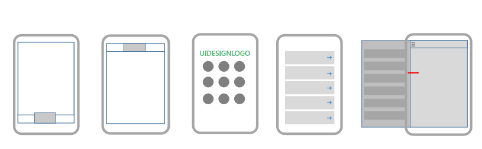

有时一个界面可能含有多种导航（混合型），如酷狗，网易云音乐APP。

不常用导航

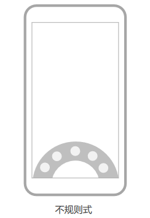

### 信息的呈现

**常见表现形式**

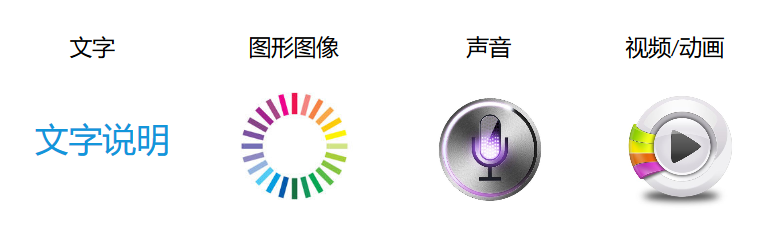

**组织形式**

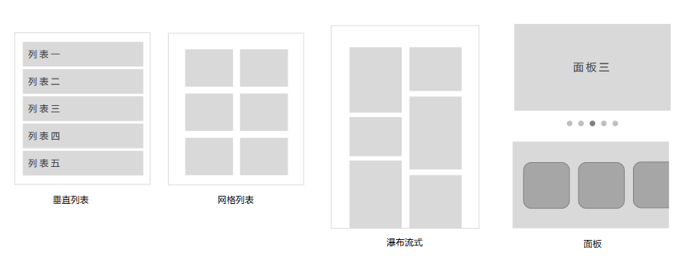

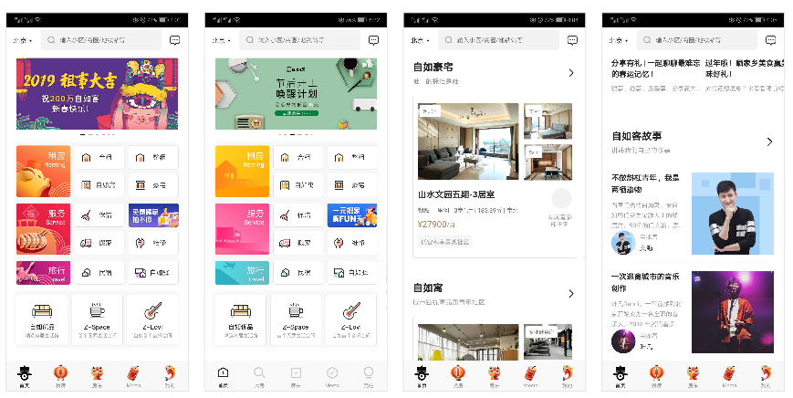

Axure设计模板：

界面：375*667

### 设计技巧

合理组织、突出重点、善于隐藏

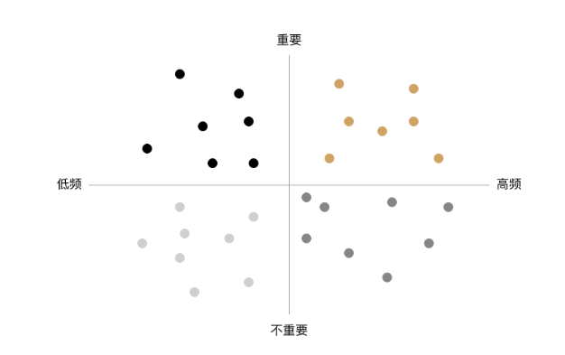

### 设计流程

框架设计--->主流程界面设计--->一级界面设计--->子界面设计

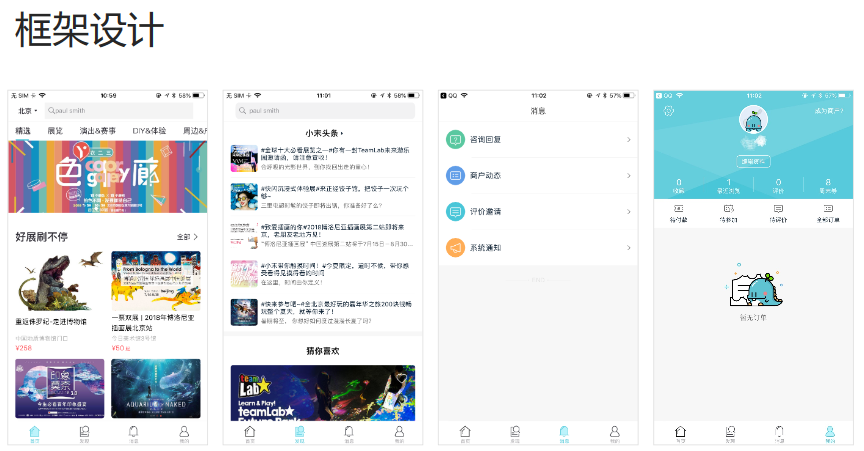

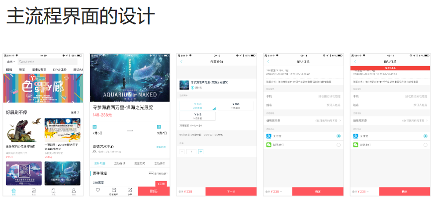

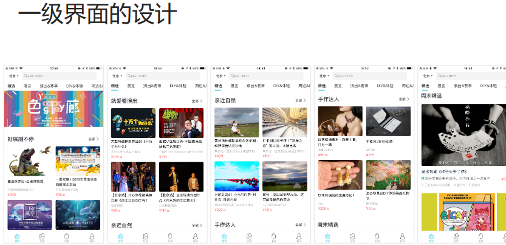

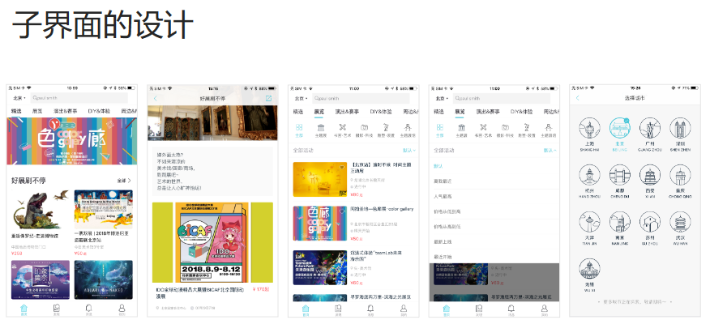

### 典型界面设计

**主页**

这是个什么样的产品？

主要功能？

如何开始？

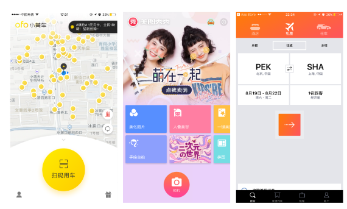

**列表页**：帮助用户寻找与决策

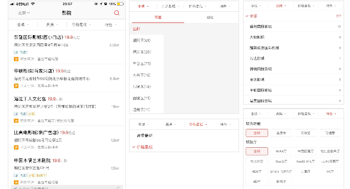

**详情页**：提升页面转化率

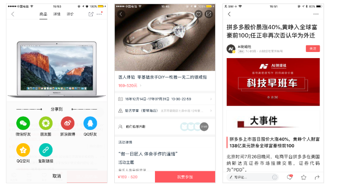

**登录注册**：准确，顺利，快速

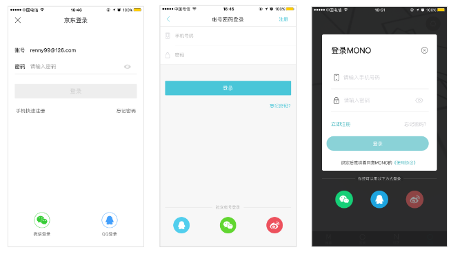

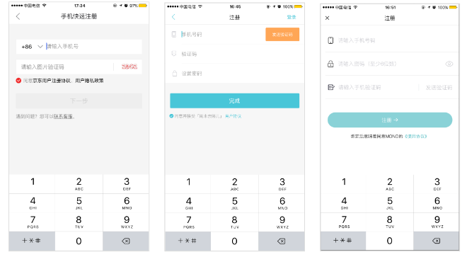

### iOS和Android设计异同

同一个App的iOS和Android版本应不应该一致？

**理想的情况：遵循各自平台的风格和规范。**

对用户可能不友好，但对系统和开发者比较合适，同样公司可能需要招聘更多的工作人员。

**现实的情况：人少活多时间紧，能一致尽量一致。**

**未来的趋势：两个平台会越来越趋同，各种软件交互也走向一致。**

