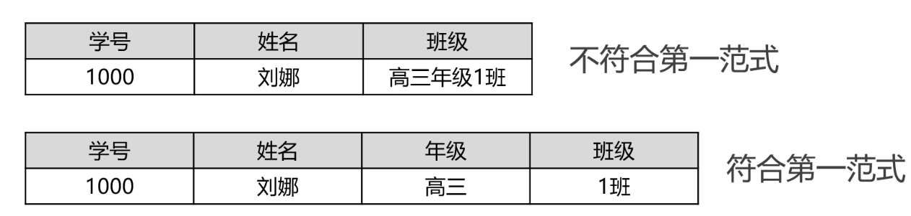
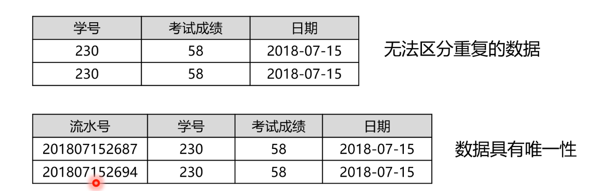
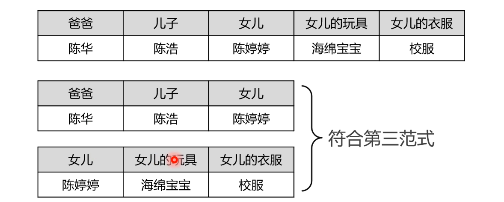
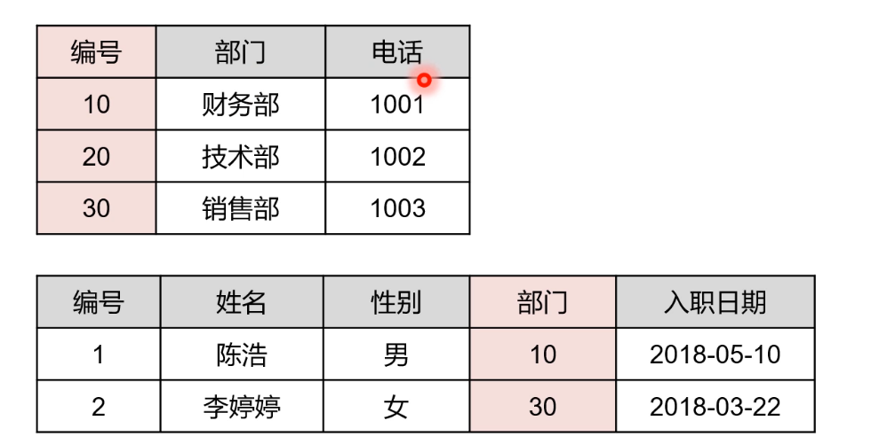
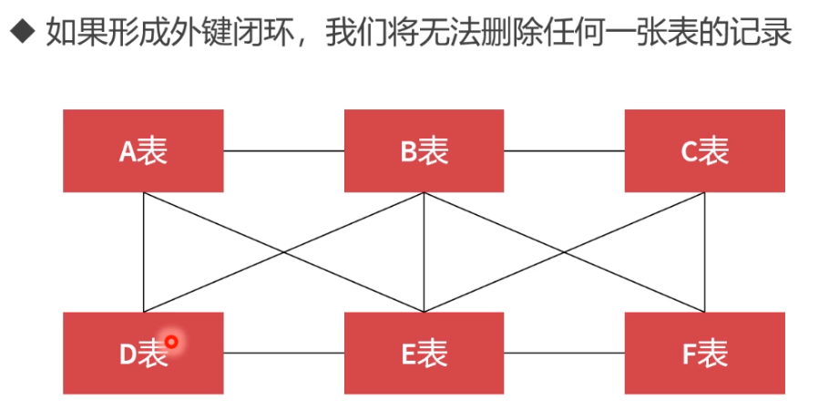

### SQL

用于访问和处理数据的标准的计算机语言

**分类**

- DML：数据操作语言，增删改查
- DCL：数据控制语言，创建用户，分配权限，事务管理
- DDL：数据定义语言，逻辑库，数据表，视图，索引

注意事项

1. SQL语句不区分大小写，但多数情况用大写表示。但字符串区分大小写
2. 分号结尾
3. 语句中空白和换行没有限制，但不能破坏语法

### 创建逻辑库

在关系型数据库里面，如果想要保存数据，必须现有逻辑空间，也就是先在目录文件里创建文件夹

```sql
CREATE DATABASE name;	// 创建逻辑空间
SHOW DATABASES; 		// 查看所有逻辑空间
DROP DATABASE name;		// 删除逻辑空间
```

以上三条均属于DDL语句

### 创建数据表

同样也属于DDL语句

```sql
CREATE TABLE 数据表(
    列名1 数据类型 [约束] [COMMENT 注释],
    列名2 数据类型 [约束] [COMMENT 注释],
    ......
)[COMMENT = 注释]

// 例子
CREATE TABLE student(
    id INT UNSIGNED PRIMARY KEY,
    name VARCHAR(20) NOT NULL,
    sex CHAR(1) NOT NULL,
    birthday DATE NOT NULL,
    tel CHAR(11) NOT NULL,
    remark VARCHAR(200)
)
```

在创建数据表之前，需要先确定在哪一个逻辑空间创建

```sql
USE 逻辑空间名;
```

数据表的其他操作

```sql
SHOW tables;	// 查看逻辑空间里面的数据表
DESC student;	// 查看数据表的具体情况
SHOW CREATE TABLE student;		// 查看数据表创建初的SQL语句
DROP TABLE student;		//删除数据表
```

### 数据类型


单精度和双精度在表示数字的时候并不是很精确，对于精度要求不是很高的数据或者不是很重要的数据，用float和double没问题。但如果要求很精确，需要使用decimal，对于整数还是浮点数，它都是按照字符串的方式进行保存。

十进制转二进制，如果是整数，不会存在精度丢失，但浮点数就可能丢失。


### 修改表结构

依然属于DDL语句，而且它们基本是以ALTER开头

添加字段：

```sql
ALTER TABLE 表名称
	ADD 列1 数据类型 [约束] [COMMENT 注释],
	ADD 列2 数据类型 [约束] [COMMENT 注释],
	......;
```

修改字段：

```sql
ALTER TABLE 表名称
	MODIFY 列1 数据类型 [约束] [COMMENT 注释],
	MODIFY 列1 数据类型 [约束] [COMMENT 注释],
	......;
```

修改字段名称：

```sql
ALTER TABLE 表名称
	CHANGE 列1 新列名1 数据类型 [约束] [COMMENT 注释],
	CHANGE 列2 新列名2 数据类型 [约束] [COMMENT 注释],
	......;
```

删除字段：

```sql
ALTER TABLE 表名称
	DROP 列1,
	DROP 列2,
	......;
```

修改表名：

```sql
ALTER TABLE 表名 RENAME 新表名
```


### 数据库的范式

构建数据库必须遵循一定的规则，这种规则就是范式，目前关系型数据库范式有6种，一般只需满足第三范式即可。

**第一范式：原子性**

第一范式是数据库的基本要求，不满足这一点就不是关系型数据库。

数据表的每一列都是不可分割的基本数据项，同一列中不能有多个值，也不能存在重复的属性。



**第二范式：唯一性**

数据表中的每条记录必须是唯一的。为了实现区分，通常要为表加上一个列来存储唯一标识，这个唯一属性被称作主键列。



**第三范式：关联性**

当满足第三的时候，也满足了第一和第二。

每列都与主键有直接关系，不存在传递依赖，不相关的字段要拆分到数据表里边，表和表之间是可以保持关系的。






### 字段约束

MySQL中的字段约束共有四种：

| 约束名称 | 关键字      | 描述                     |
| -------- | ----------- | ------------------------ |
| 主键约束 | PRIMARY KEY | 字段值唯一，且不能为NULL |
| 非空约束 | NOT NULL    | 字段值不能为NULL         |
| 唯一约束 | UNIQUE      | 字段值唯一，且可以为NULL |
| 外键约束 | FOREIGN KEY | 保持关联数据的逻辑性     |

建议主键一定要用数字类型，这样检测速度会非常快。

外键约束带来的问题：




### 索引

MySQL利用二叉树结构，对数据表的记录排序，从而加速了数据检索的速度。

**创建索引**

```sql
CREATE TABLE 表名称(
    ......,
    INDEX [索引名称](字段)
    ......
);
```

**添加/删除索引**

```sql
CREATE INDEX 索引名称 ON 表名(字段);
ALTER TABLE 表名称 ADD INDEX [索引名](字段);
SHOW INDEX FROM 表名;
DROP INDEX 索引名称 ON 表名;
```

数据量很大，而且经常被查询的数据表可以设置索引

索引只添加在经常被用作检索条件的字段上面

不要在大字段上创建索引