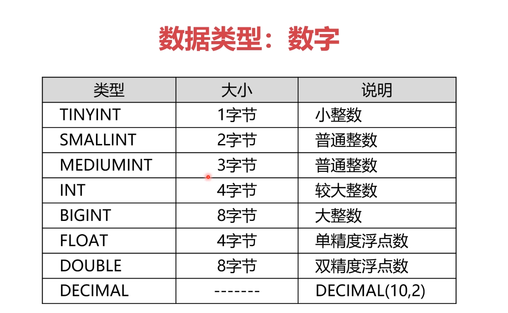
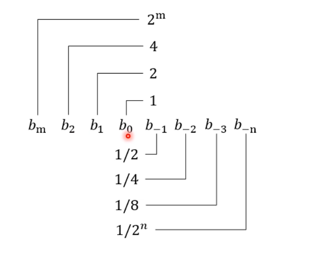
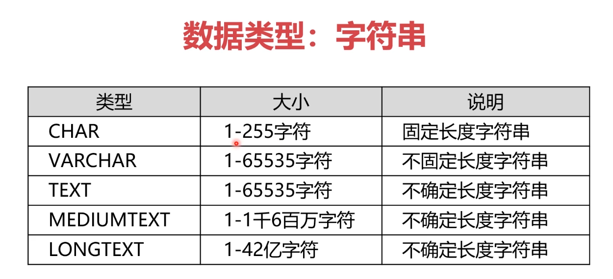
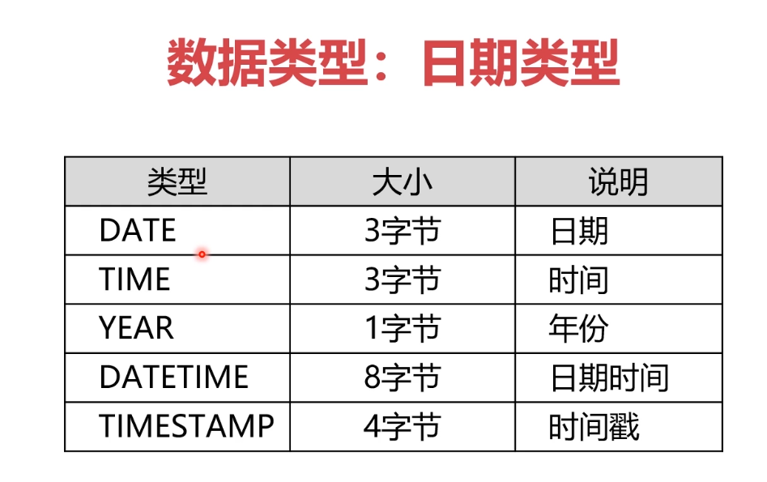

Windows、Mac、Linux都是基于文件的操作系统

文件能保存数据，为什么不用文件来管理数据？

很简单，操作不方便，尤其是大量数据，还需要多个数据相关联时。

数据库是为我们屏蔽了底层数据的操作，只需通过SQL语句就能操作成千上万条数据。

### 定义

**数据库系统（DBMS）**是指一个能为用户提供信息服务的系统，它实现了有组织、动态地存储大量相关数据的功能，提供了数据处理和信息资源共享的便利手段。

**关系型数据库（RDBMS**），使用了关系模型的数据库系统。关系模型中，数据是分类存放的，数据之间可以有联系。它可以有效组织和管理大量复杂的数据。该类数据库都是多线程的

主流关系型数据库：DB2（IBM）、Oracle、MySQL（开源免费，灵活），SQLServer（一般用于教学，不能部署在Linux上，生产领域没人用）

企业一般将数据库部署在Linux上。

**非关系型数据库（NoSQL）**，数据分类存放，但是数据之间没有关联关系，也没有严格的表结构，并且这类数据库没有提供SQL语言可以关联。该类数据库保存数据之前需要先建表，并且是单线程。低价值的数据可以用它保存，用户登录信息，验证，网站通知消息等。

主流非关系型数据库：Redis（用内存保存数据，读取速度飞快）、MemCache（也是内存保存数据，但份额比Redis低很多）、MongoDB（用硬盘保存数据）、Neo4J（也是用硬盘保存数据，复杂的数据）


### SQL

用于访问和处理数据的标准的计算机语言

**分类**

- DML：数据操作语言，增删改查
- DCL：数据控制语言，创建用户，分配权限，事务管理
- DDL：数据定义语言，逻辑库，数据表，视图，索引

注意事项

1. SQL语句不区分大小写，但多数情况用大写表示。但字符串区分大小写
2. 分号结尾
3. 语句中空白和换行没有限制，但不能破坏语法

**创建逻辑库**

在关系型数据库里面，如果想要保存数据，必须现有逻辑空间，也就是先在目录文件里创建文件夹

```sql
CREATE DATABASE name;	// 创建逻辑空间
SHOW DATABASES; 		// 查看所有逻辑空间
DROP DATABASE name;		// 删除逻辑空间
```

以上三条均属于DDL语句

**创建数据表**

同样也属于DDL语句

```sql
CREATE TABLE 数据表(
    列名1 数据类型 [约束] [COMMENT 注释],
    列名2 数据类型 [约束] [COMMENT 注释],
    ......
)[COMMENT = 注释]

// 例子
CREATE TABLE student(
    id INT UNSIGNED PRIMARY KEY,
    name VARCHAR(20) NOT NULL,
    sex CHAR(1) NOT NULL,
    birthday DATE NOT NULL,
    tel CHAR(11) NOT NULL,
    remark VARCHAR(200)
)
```

在创建数据表之前，需要先确定在哪一个逻辑空间创建

```sql
USE 逻辑空间名;
```

数据表的其他操作

```sql
SHOW tables;	// 查看逻辑空间里面的数据表
DESC student;	// 查看数据表的具体情况
SHOW CREATE TABLE student;		// 查看数据表创建初的SQL语句
DROP TABLE student;		//删除数据表
```

**数据类型**



单精度和双精度在表示数字的时候并不是很精确，对于精度要求不是很高的数据或者不是很重要的数据，用float和double没问题。但如果要求很精确，需要使用decimal，对于整数还是浮点数，它都是按照字符串的方式进行保存。

十进制转二进制，如果是整数，不会存在精度丢失，但浮点数就可能丢失。







**修改表结构**

依然属于DDL语句，而且它们基本是以ALTER开头

添加字段：

```sql
ALTER TABLE 表名称
	ADD 列1 数据类型 [约束] [COMMENT 注释],
	ADD 列2 数据类型 [约束] [COMMENT 注释],
	......;
```

修改字段：

```sql
ALTER TABLE 表名称
	MODIFY 列1 数据类型 [约束] [COMMENT 注释],
	MODIFY 列1 数据类型 [约束] [COMMENT 注释],
	......;
```

修改字段名称：

```sql
ALTER TABLE 表名称
	CHANGE 列1 新列名1 数据类型 [约束] [COMMENT 注释],
	CHANGE 列2 新列名2 数据类型 [约束] [COMMENT 注释],
	......;
```

删除字段：

```sql
ALTER TABLE 表名称
	DROP 列1,
	DROP 列2,
	......;
```

修改表名：

```sql
ALTER TABLE 表名 RENAME 新表名
```

